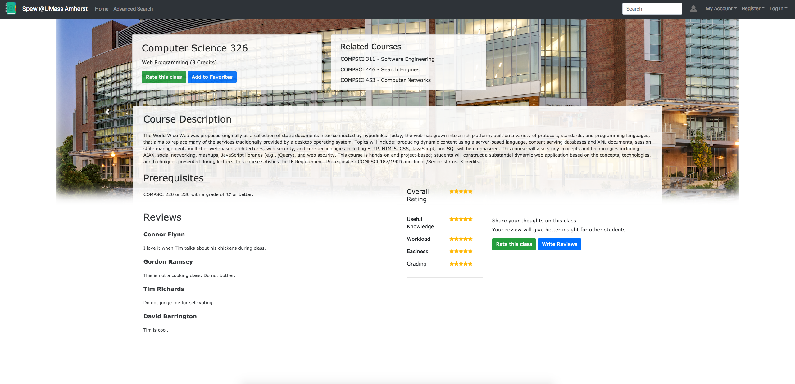

# TEAM NAME
Weebs

# WEB APPLICATION NAME
Spew

# Team Overview

* Lucas Phan, lucasphan09
* Nhi Lam, nhinja
* Thanh Pham, tcpham14
* Michael Ahn, ahnmichaelR
* Taesan Yoon, taejohnny

# Innovative Idea

Please describe your team's innovative idea for your project.

# Important Data

Please describe the important data that your application will be managing.

# User Interface

Provide a description and images of the user interface your
application will intend on supporting.

Here is the homepage. It will contain information about the current top classes, popular classes, featured class, and other eye-catching options. 

The search results page will display a list of all the classes related to the search input. It will display all important information on the left, such as pre-reqs, gen-eds, etc. 

The advanced search is similar to spire, but much more accessible and easier to read. It keeps important information while disregarding a lot of the pointless info on spire.

