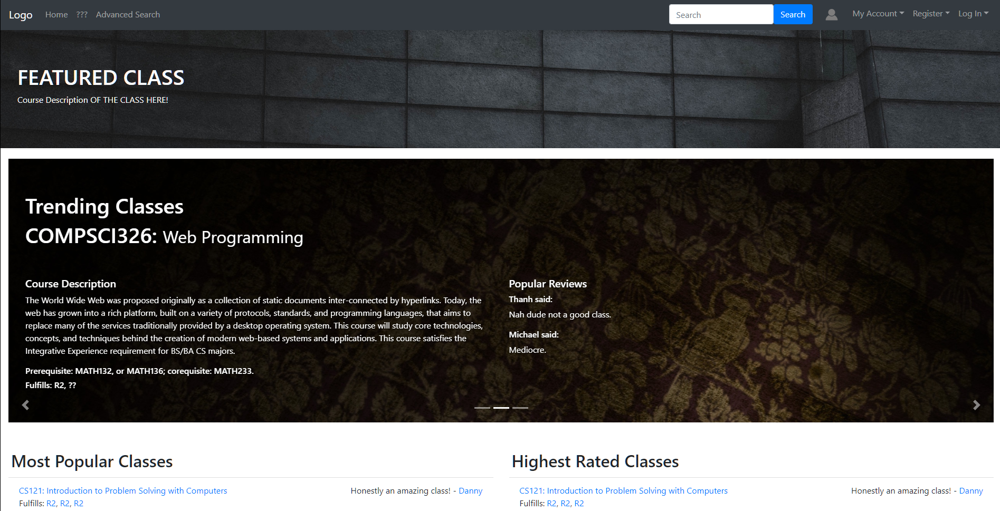
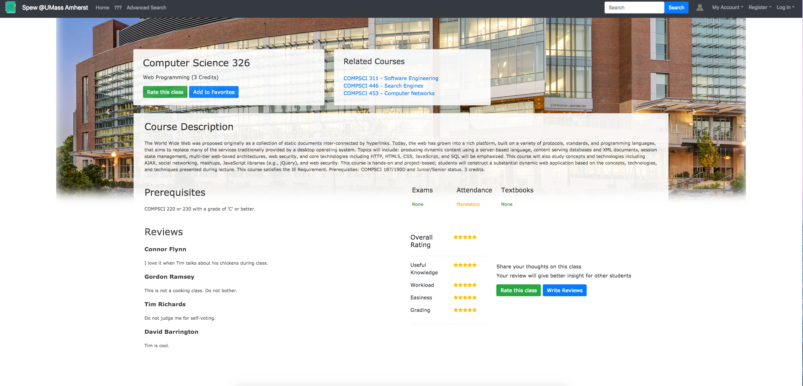
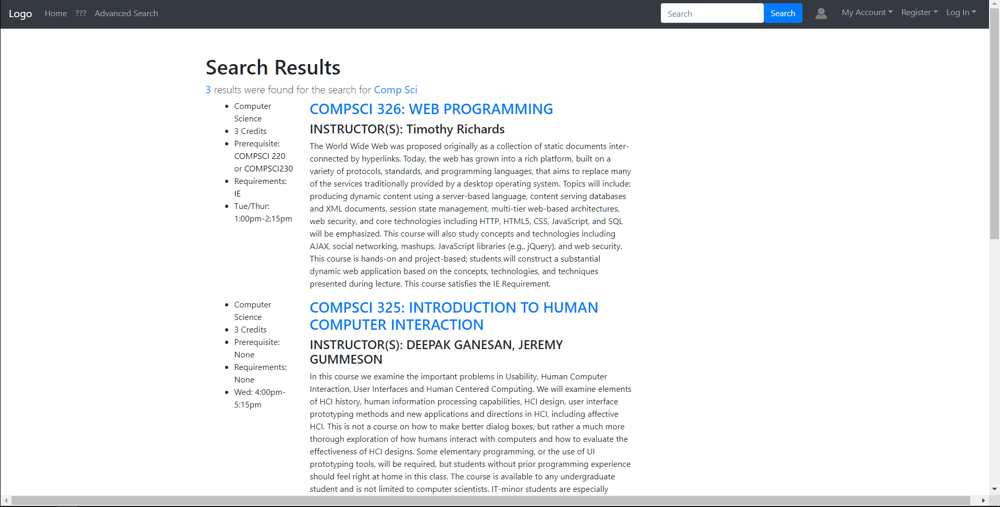
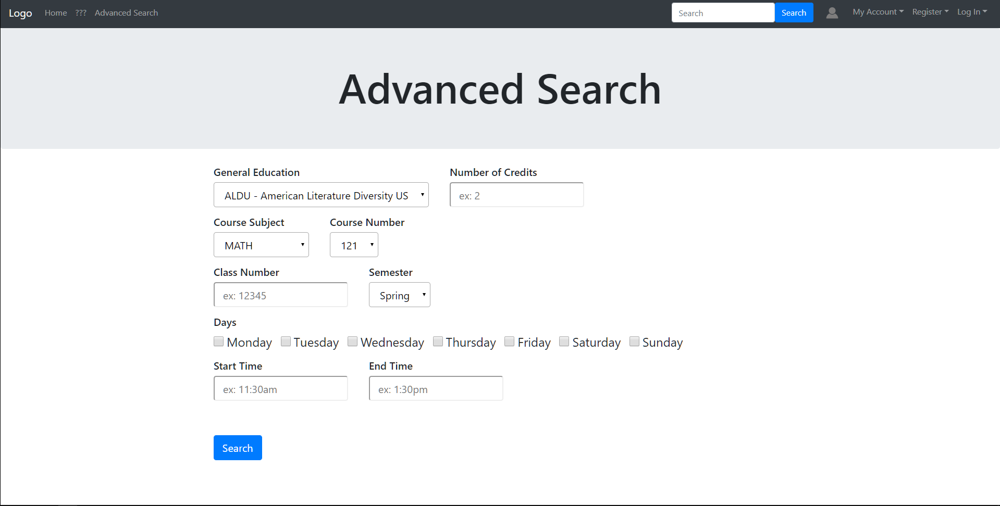
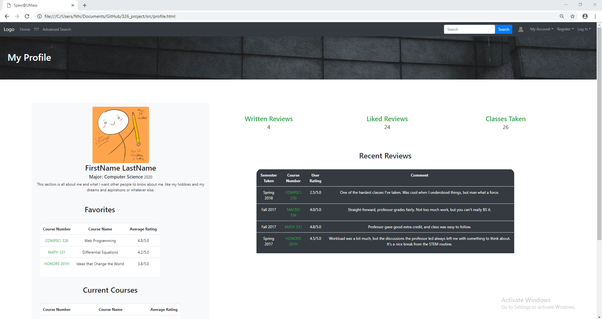
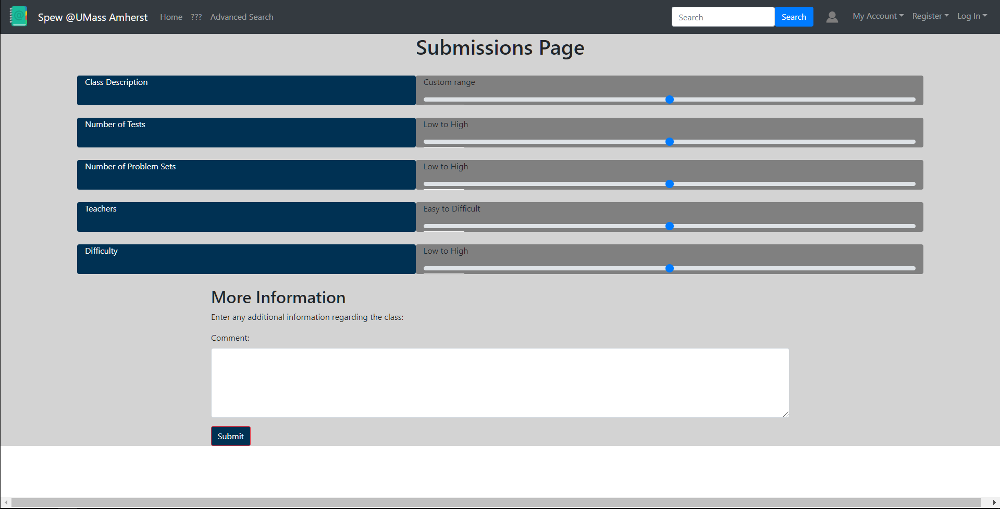

# TEAM NAME
Weebs
# WEB APPLICATION NAME
Spew

# Team Overview

* Lucas Phan, lucasphan09
* Nhi Lam, nhinja
* Thanh Pham, tcpham14
* Michael Ahn, ahnmichaelR
* Taesan Yoon, taejohnny
 
# Innovative Idea

Spew is an innovative student-driven database centered around finding the perfect class for any student. It provides an array of information on any class offered at UMass, such as required textbooks, instructors, attendance and so on. It also allows students to share feedback in the form of reviews, along with ratings based on certain disciplines of the class. This application will allow students to view most-rated and highest-rated classes, along with the ability to view related classes in the form of track based on the student's concentration. 
# Important Data

Our application will need to keep track of many types of data pertaining to classes: class times, gen-ed fulfillments, professors, days, semester, credits, course subject, course number, and class number. These different criteria will be essential to our search system in order to find classes. We will also be have data on the user: their reviews of different courses, their ratings of the courses, a favorite classes list, and their majors/minors. We will also have data on popularity of a course and how highly rated it is on average in order to populate the homepage. 
# User Interface

Here is the homepage. It will contain information about the current top classes, popular classes, featured class, and other eye-catching options. 
 
 The following is the class page, which displays general class information, along with classes that are relevant to the currently viewed class in the top right. Further down, reviews are submitted by students and ratings are also submitted based on specific disciplines of that class.

 The search results page will display a list of all the classes related to the search input. It will display all important information on the left, such as pre-reqs, gen-eds, etc. 
 
 The advanced search is similar to spire, but much more accessible and easier to read. It keeps important information while disregarding a lot of the pointless info on spire.

The following is a user's profile page on the website. While the class ratings are the center of the site, we thought it could be similar to a social media platform, and it's nice to have everything in one place for the user and others to refer to.

Here is the page for rating a class: the user will be able to rate the class on a scale and leave a comment, which will be public and visible to all other users on the site.

